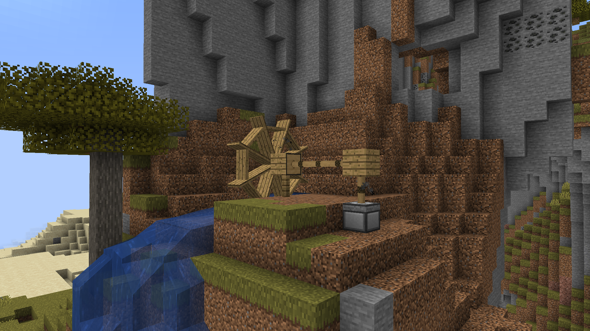
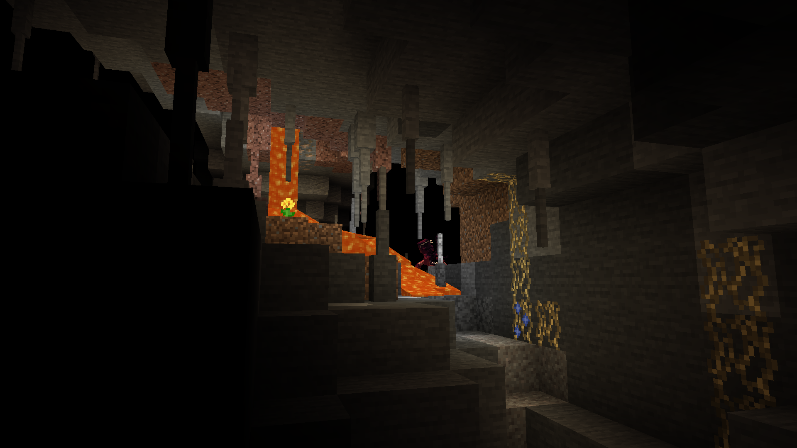
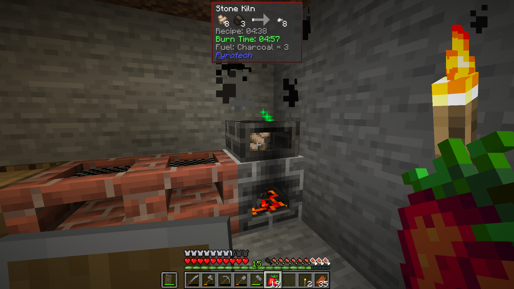

\
(totaly didn't draw this logo in paint)

# FEATURES AND CHANGES
- Wooden tools are skipped. Pick up some rocks, break up tree bark into sticks, and make stone tools.
- Easier tree chopping
- Swimming backported from 1.13
- Faster and smarter mobs
- New weapons to defend yourself with
- Ability to use your offhand to attack
- Numerous changed recipes
- More challenging hunger system
- Mechnical power
- "Towering up" with blocks to escape mobs no longer works
- Darker caves
- Moon phases determine how dark night time is
- Blood moons that increase monster spawn rates
- Numerous changed crafting recipes to slow down progression

# SCREENSHOTS
\
\

# INSTALLATION
## PRISM LAUNCHER
These steps are specifically for Prism Launcher. If Prism Launcher is the recommended method of installation, however if Prism Launcher or any of its dependencies do not funciton on your system, please see the **launcher agnostic** guide.
1. Download and install **[Prism Launcher](https://prismlauncher.org)**, and follow the instructions for your operating system (Windows, Mac, Linux/Steam OS).
2. Once **Prism Launcher** is installed and opened successfully, Pick your language, launcher theme, and cat picture.
3. Log into **Prism Launcher** with your minecraft account.
4. Move **Prism Launcher** to the side and open your **web browser** (Google Chrome, Safari, Ungoogled Chromium, Brave, Firefox, Librewolf, etc).
5. In your **web browser**, head to the Project Virulence **[releases page](https://github.com/HydratedBean/Project-Virulence/releases)** and download the Stable release ``Project-Virulence.zip`` to your desktop.
6. Move back to **Prism Launcher**, and import ``Project-Virulence.zip`` as an instance.
7. Project Virulence runs on **[Cleanroom](https://cleanroommc.com/)** and needs **at least** `Java 21` to run, however it is recommended to run it with `Java 24` for better performance. \
7a. In **Prism Launcher** click on **Settings** in the top left corner. \
7b. In the pop-up, click **Java** \
7c. Under **Java**, click **Management** \
7d. Under **Management** click **Download** \
7e. Under **Download**, click **Azul Zulu**, and **uncheck Recommended** \
7f. Select ``Java 24``, and download it. When the Download finishes, close out of settings.
8. Select ``Project-Virulence`` in the launcher and click the **Edit** button on the right of the launcher
9. Within the **Edit** menu, select **Settings**
10. Checkmark **Java installation**
11. Click **Auto-detect**
12. Choose ``Java 24`` and close settings
13. Press launch to start playing

## OTHER LAUNCHERS
***Should*** work on any launcher that supports running mods. Guide is much more vague since not all launchers are the same.

1. Install [Java 24](https://www.azul.com/downloads/?package=jdk#zulu) to your system.
2. Install the **latest** Minecraft 1.12.2 [Forge](https://files.minecraftforge.net/net/minecraftforge/forge/index_1.12.2.html).
3. Download [packwiz-installer-bootstrap](https://github.com/packwiz/packwiz-installer-bootstrap/releases).
4. Move `packwiz-installer-bootstrap.jar` to your `.minecraft` folder.
5. Open a command line in your `.minecraft` folder.
6. Run `java -jar ./packwiz-installer-bootstrap.jar https://raw.githubusercontent.com/HydratedBean/Project-Virulence/refs/heads/main/pack.toml`
7. Go into the `mods` folder.
8. Download and move [MixinBooter](https://legacy.curseforge.com/minecraft/mc-mods/mixin-booter), [ConfigAnytime](https://legacy.curseforge.com/minecraft/mc-mods/configanytime), and [Cleanroom Relauncher Unofficial](https://legacy.curseforge.com/minecraft/mc-mods/cleanroom-relauncher-unofficial) into `.minecraft/mods`
9. Launch game.
10. Cleanroom Relauncher will open before the game can launch. Autodetect your `Java 24` install
11. Under the `Java Arguments` section replace `-Xmx4g -Xms4g` with `-Xmx4g -Xms512m`
12. Continue with launch. \

## SERVER
1. Install [Java 24](https://www.azul.com/downloads/?package=jdk#zulu) to your system.
2. Get the server jar [here](https://github.com/CleanroomMC/Cleanroom/releases/download/0.3.10-alpha/cleanroom-0.3.10-alpha-installer.jar) and install the server to a folder of your choice.
3. Download [packwiz-installer-bootstrap](https://github.com/packwiz/packwiz-installer-bootstrap/releases).
4. Move `packwiz-installer-bootstrap.jar` to your server folder
5. Open a command line in your server folder.
6. Run `java -jar ./packwiz-installer-bootstrap.jar https://raw.githubusercontent.com/HydratedBean/Project-Virulence/refs/heads/main/pack.toml`
7. Project Virulence doesn't need any special server properties, but you can still set some to your liking (disabling pvp, operators, etc.) \
### UPDATING A SERVER
1. Check if Project Virulence has updated to a newer cleanroom version. \
    1b. If it has, repeat step 2 from the previous guide to a new folder
2. Migrate your world files, and server properties to the new folder
3. Repeat steps 3-6 from the previous guide

<h2>🔥 Join the 1.12 Coalition! 🔥</h2>

